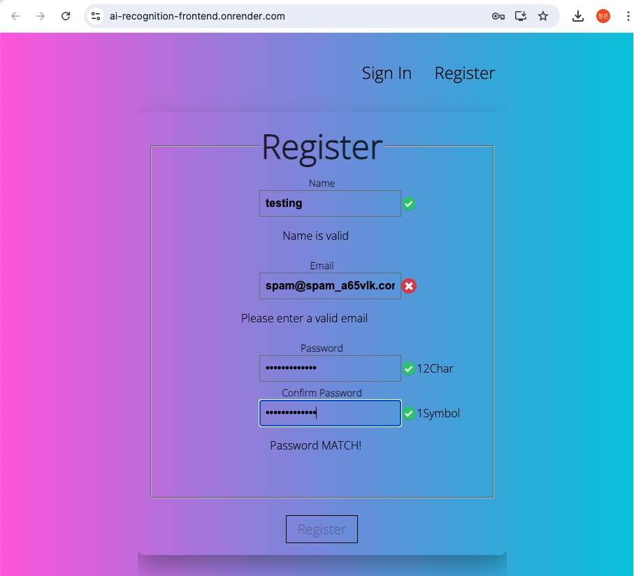
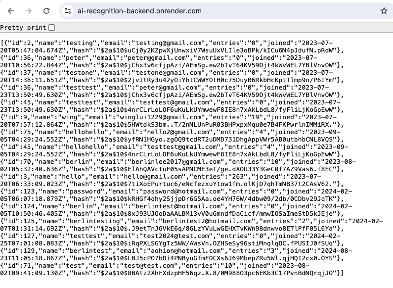

# AI-Recognition-API


## This Node.js app allows Register feature



## REST API for Login & bcrypt password hashes



## Live server: https://ai-recognition-backend.onrender.com/

## Server-side Node.js + Postgres15

# 1. Download this fun AI Node app
```bash
git clone https://github.com/PhoenixYork166/AI-Recognition-Nodejs.git;
```

# 2. Start using this Node app
```bash
npm install;
```

```bash
npm run start:dev;
```

# 3. What if you do not have all the necessary Dev dependencies on your mac OS to start this Node app?

# 4. Go to ./install-postgresql
## Read through ./install-postgresql/0_postgresql_docs.txt

# 5. Installing mac OS Node.js dev dependencies
## i. Start installing necessary dependencies 'brew' command on your mac OS
```bash
bash ./install-postgresql/1_install-brew.sh;
```

## ii. Start installing 'wget' command on your mac OS
```bash
bash ./install-postgresql/2_install-wget.sh;
```

## iii. Adding 'psql' to your Bash env on your mac OS
```bash
bash ./install-postgresql/3_add-psql-to-bash.sh;
```

## iv. Downloading PSequel GUI (PSequel GUI is still crashing in 2024)...
```bash
bash ./install-postgresql/4_download-psequel-gui.sh;
```

## v. Installing PostgreSQL on your mac OS
```bash
bash ./install-postgresql/5_install-postgres.sh;
```

## vi. Creating a database call 'test' using PostgreSQL on your mac OS
```bash
bash ./install-postgresql/6_createdb-test.sh;
```

# 6. Start re-creating database & tables necessary for starting up this Node app

## i. Start by re-creating database
```bash
bash ./database-recreation/1_create_database_smart-brain.sh;
```

## ii. Re-creating a new user for our database using Bash
```bash
bash ./database-recreation/2_create_database_user.sh;
```
## iii. Verify the newly created psql user for our database
```bash
bash ./database-recreation/3_verify-created-user.sh;
```

## iv. Create a table named 'users' in our database
```bash
bash ./database-recreation/4_create_table-users.sh;
```
## Hit 'q' key to exit when we're done verifying

## v. Create a table named 'login' in our database
```bash
bash ./database-recreation/5_create_table-login.sh;
```

## vi. Verify psql schema for 'users' table
```bash
bash ./database-recreation/6_verify_schema-users.sh;
```

## vii. Verify psql schema for 'login' table
```bash
bash ./database-recreation/7_verify_schema-login.sh;
```

## viii Connect to our psql database Shell Environment
```bash
bash ./database-recreation/8_enter-db-shell.sh;
```

## Enter 'exit' to quit Shell Environment
```bash
exit;
```